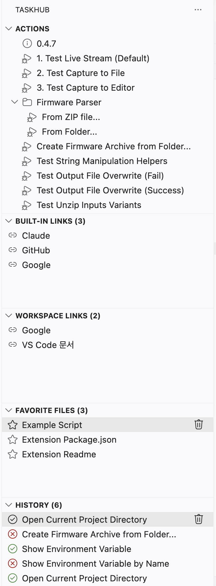
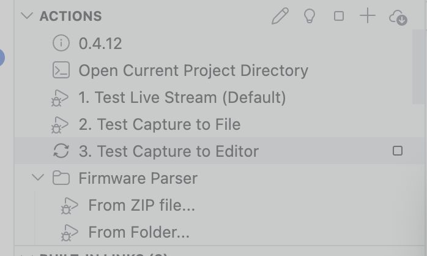
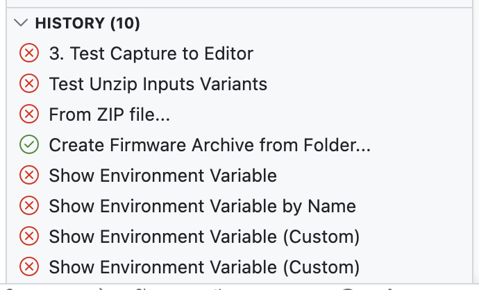
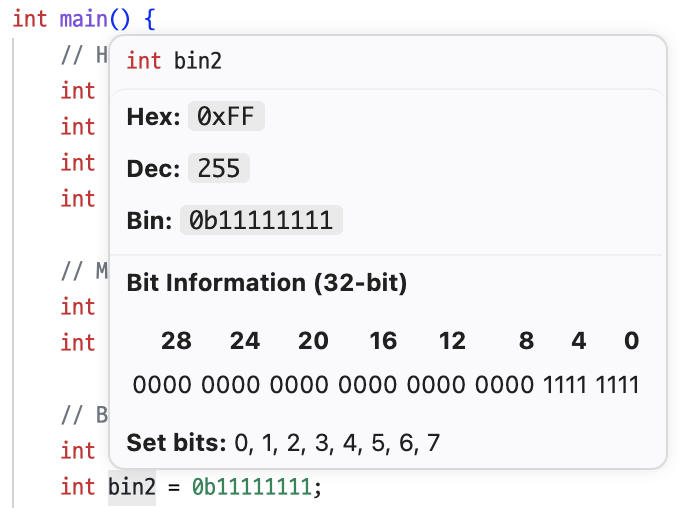
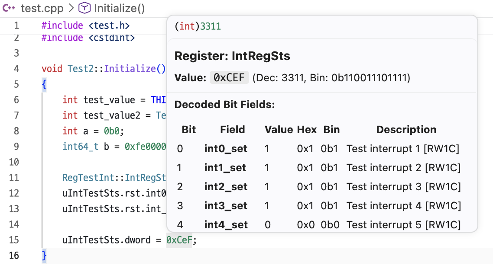
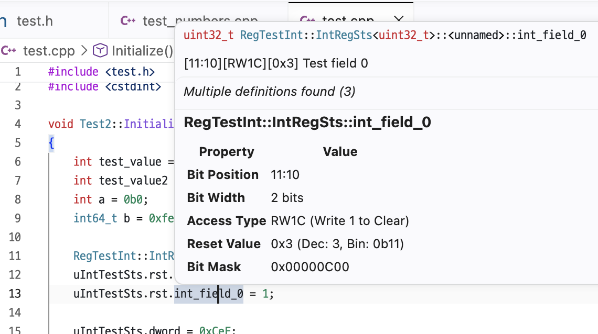
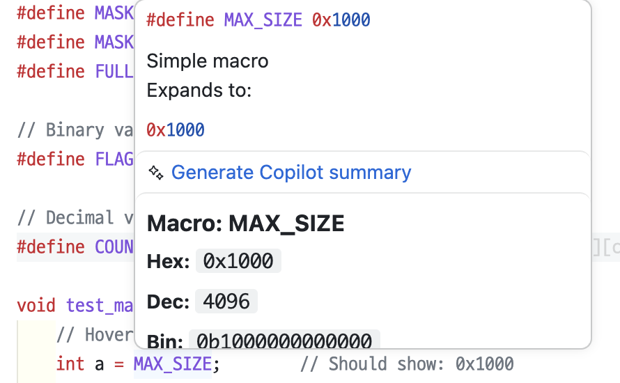
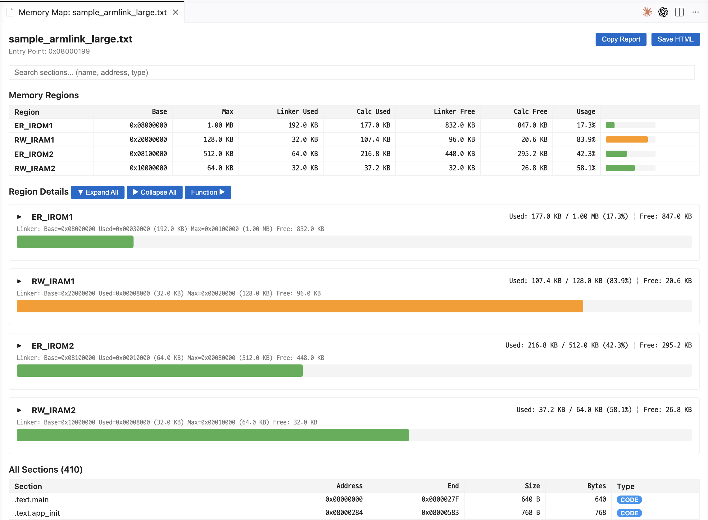
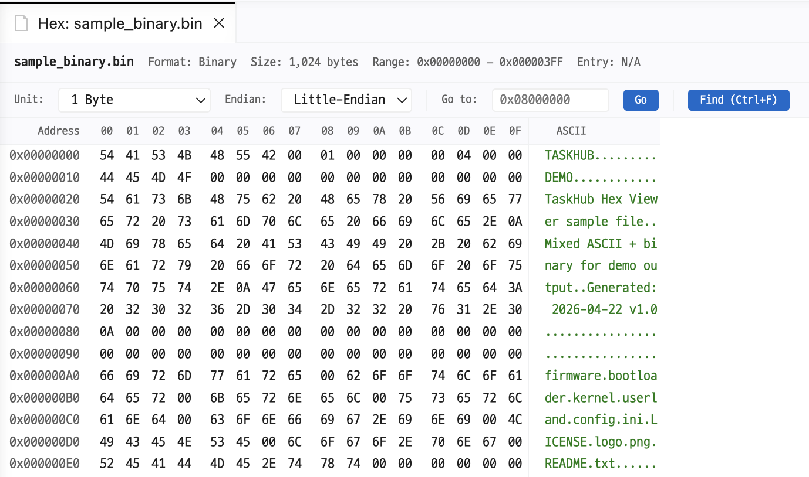
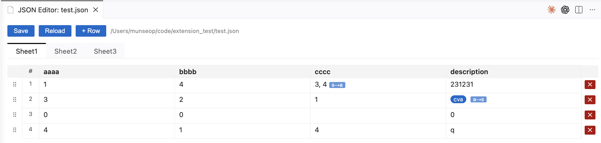

# TaskHub

> A VS Code extension that automates repetitive development workflows and provides embedded C/C++ development tooling.

[한국어](README.md) · [English](README.en.md)

---

## Table of Contents

- [Features](#features)
- [Screenshots](#screenshots)
- [Installation](#installation)
- [Usage](#usage)
- [Configuration](#configuration)
- [Documentation](#documentation)

---

## Features

### Workflow Automation
- **Custom Actions** — Run shell commands, archive operations, string manipulation, and more, all defined in JSON
- **Pipelines** — Chain multiple tasks and pass results via `${task_id.property}` substitution
- **Action Creation Wizard** — Build new actions through an interactive UI, no manual JSON editing required
- **Presets** — Share per-environment action configurations with your team
- **Run History** — Track success/failure status with one-click re-run

### Sidebar Panels
- **Actions** — Action buttons in tree grouping, with search and filtering
- **Links** — Built-in / Workspace link management
- **Favorites** — Frequently-used files with line-number bookmarks
- **History** — Execution log with status indicators

### C/C++ Hover (Embedded-focused)
- **Number Base Hover** — Instant Hex / Dec / Bin conversion with 32-bit bit map
- **SFR Bit Field Hover** — Special Function Register bit field info (position, access type, reset value, mask)
- **Register Decoder Hover** — Decode register literals into per-field values
- **Macro Expansion Hover** — Final expansion result of `#define` macros
- **Struct Size Hover** — Struct/class size, member offsets, and padding
- **Bit Operation Hover** *(experimental)* — Preview bit operation results

### Viewers
- **Memory Map Visualization** — Parse ARM Linker Listing / GNU ld output
- **Hex Viewer** — Address / hex / ASCII columns with Unit, Endian, Go-to, and Find
- **JSON Editor** — Spreadsheet-style JSON editing

> See [docs/features.md](docs/features.md) for detailed explanations and JSON examples.

---

## Screenshots

### Workflow

<table>
  <tr>
    <td align="center" width="34%">
      <b>Sidebar</b> 
      Actions · Links · Favorites · History in one view 
      
    </td>
    <td align="center" width="33%">
      <b>Action Execution</b> 
      Running-state indicator 
      
    </td>
    <td align="center" width="33%">
      <b>Run History</b> 
      Success/failure log with quick re-run 
      
    </td>
  </tr>
</table>

### C/C++ Hover

<table>
  <tr>
    <td align="center" width="50%">
      <b>Number Base Hover</b> 
      Literal base conversion + 32-bit bit map 
      
    </td>
    <td align="center" width="50%">
      <b>Register Decoder Hover</b> 
      Decode register values into bit fields 
      
    </td>
  </tr>
  <tr>
    <td align="center" width="50%">
      <b>SFR Bit Field Hover</b> 
      Position, access type, reset value at a glance 
      
    </td>
    <td align="center" width="50%">
      <b>Macro Expansion Hover</b> 
      Final expansion of <code>#define</code> macros 
      
    </td>
  </tr>
</table>

### Viewers

**Memory Map Visualization** — Parses ARM Linker Listing / GNU ld output to show per-region usage, sections, and function distribution.

**Hex Viewer** — Displays binary files in address / hex / ASCII columns. Supports Unit (1/2/4/8 byte), Endian, Go-to, and Find.

**JSON Editor** — Edit JSON arrays/objects in a spreadsheet UI. Supports row add/delete/drag and cell-type conversion (`s→a`, `a→s`).

---

## Installation

### Manual install (VSIX)

1. Download the latest `.vsix` from [Releases](https://github.com/MunseopLim/TaskHub/releases)
2. In VS Code, press `Ctrl+Shift+P` (macOS: `Cmd+Shift+P`) → **Extensions: Install from VSIX...**
3. Select the downloaded `.vsix` file

To build from source or contribute, see [CONTRIBUTING.md](CONTRIBUTING.md).

---

## Usage

1. Click the **'H' icon** in the Activity Bar to open the TaskHub view
2. Run actions from the Actions panel; access resources from the Links panel
3. Customize by editing `.vscode/actions.json`, `.vscode/links.json`, and `.vscode/favorites.json`

---

## Configuration

<b>All configuration options</b>

 

| Setting ID | Type | Default | Description |
| --- | --- | --- | --- |
| `taskhub.showTaskStatus` | `boolean` | `true` | Enable action status icons and completion popups |
| `taskhub.pipeline.showVerboseLogs` | `boolean` | `false` | Show verbose logs during pipeline execution |
| `taskhub.pipeline.pythonIoEncoding` | `string` | `utf-8` | Value of the `PYTHONIOENCODING` environment variable |
| `taskhub.pipeline.windowsPowerShellEncoding` | `string` | `utf8` | PowerShell output encoding on Windows |
| `taskhub.pipeline.outputCaptureLimitMb` | `number` | `10` | Max captured stdout/stderr size in capture mode (1–1024 MB; process is killed with an explicit error when exceeded) |
| `taskhub.history.maxItems` | `number` | `10` | Max history entries (1-50) |
| `taskhub.history.showPanel` | `boolean` | `true` | Show the History panel |
| `taskhub.hover.numberBase.enabled` | `boolean` | `true` | Enable Number Base / SFR hover |
| `taskhub.experimental.bitOperationHover.enabled` | `boolean` | `false` | [Experimental] Enable bit-operation hover |
| `taskhub.preset.selected` | `string` | `none` | Preset to auto-apply |

---

## Documentation

| Doc | Description |
|------|------|
| [docs/features.md](docs/features.md) | Detailed feature docs (task types, JSON examples, hover features) |
| [docs/architecture.md](docs/architecture.md) | Project structure, key components, data structures, security |
| [docs/roadmap.md](docs/roadmap.md) | Future roadmap + already-shipped items |
| [CONTRIBUTING.md](CONTRIBUTING.md) | Dev setup, build, test, and contribution guide |
| [CLAUDE.md](CLAUDE.md) | AI-agent rules (coding conventions, i18n, commit format) |
| [CHANGELOG.md](CHANGELOG.md) | Version history |
| [examples/README.md](examples/README.md) | Demo files for each feature |

---

## License

[MIT](LICENSE)
