# TaskHub

> 반복적인 개발 작업을 자동화하고, 임베디드 C/C++ 개발에 특화된 hover 도구를 제공하는 VS Code 확장 프로그램.

[한국어](README.md) · [English](README.en.md)

---

## 목차

- [핵심 기능](#핵심-기능)
- [스크린샷](#스크린샷)
- [설치](#설치)
- [사용법](#사용법)
- [보안](#보안)
- [설정](#설정)
- [문서](#문서)

---

## 핵심 기능

### 워크플로우 자동화
- **사용자 정의 액션** — 셸 명령, 파일 압축/해제, 문자열 처리 등을 JSON으로 정의·실행
- **파이프라인** — 여러 태스크를 순서대로 실행하며 `${task_id.property}`로 결과 연결, `switch`로 선택값별 작업을 한곳에 구성
- **액션 생성 마법사** — 대화형 UI로 코드 작성 없이 액션 생성
- **Preset** — 팀원들과 action 설정 공유
- **실행 히스토리** — 성공/실패 추적, 새 입력 또는 저장 입력으로 명시적 재실행
- **입력 프로필** — History에서 반복 입력 조합을 이름 붙여 저장하고 액션 메뉴에서 재사용
- **Quick Action Palette** — Actions의 돋보기나 `TaskHub: 액션 실행…` 명령으로 모든 액션을 fuzzy 검색·실행. 최근 실행 항목을 상위에 표시 (개수는 설정에서 조정)
- **Status Bar 기능 런처** — 하단의 TaskHub 항목에서 자주 쓰는 기능을 검색하고 최근 선택 3개에 빠르게 접근
- **Problem Matcher** — 빌드 출력의 컴파일러 에러·경고를 Problems 패널에 자동 표시 (gcc / TypeScript 프리셋 또는 커스텀 정규식)

### 사이드바 패널
- **Actions** — 액션 버튼과 폴더 트리, 검색/그룹화
- **링크** — 워크스페이스 `.vscode/links.json` 기반 링크 관리
- **즐겨찾기** — 자주 쓰는 파일을 줄 번호와 함께 저장
- **히스토리** — 실행 기록과 상태 표시

### C/C++ Hover (임베디드 개발 특화)
- **Number Base Hover** — 숫자 리터럴의 Hex / Dec / Bin 진법 변환과 비트 정보
- **SFR Bit Field Hover** — 레지스터 비트 필드 정보 (위치, 접근 타입, 리셋 값, 마스크)
- **Register Decoder Hover** — 레지스터에 대입된 값을 비트 필드 단위로 디코드
- **Macro Expansion Hover** — `#define` 매크로의 최종 확장 결과
- **Struct Size Hover** — 구조체/클래스 크기, 멤버별 오프셋, 패딩 자동 계산
- **Bit Operation Hover** *(실험적)* — 비트 연산 결과 미리보기

### 뷰어
- **Memory Map 시각화** — ELF/AXF와 ARM Linker Listing 분석, 메모리 영역 표시, 심볼·섹션 바이트와 DWARF 소스 위치 연결
- **Hex Viewer** — 주소/16진/ASCII 3단, Unit·Endian·Go-to·Find 지원
- **Hex/Text 변환기** — 문자열·Hex 바이트 실시간 변환, 자주 쓰는 값 저장, 8/16/32/64비트 정수 비트 연산
- **JSON Editor** — JSON 배열/객체를 스프레드시트 UI로 편집

> 상세 설명과 JSON 예제는 [docs/features.md](docs/features.md) 참조.

---

## 스크린샷

### 워크플로우 — Build → Verify → ZIP

센서 데이터 바이너리를 생성·검증·압축하는 액션을 실행하고, 출력과 실행 기록을 함께 확인합니다. [실행 예제](examples/sensor_pipeline/README.md)

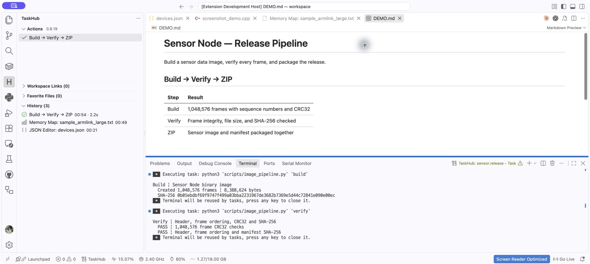

### Memory Map — 메모리 사용량과 영역 상세

ARM Linker Listing의 Flash·RAM 사용량을 살펴보고, 영역을 펼쳐 섹션과 함수 배치를 확인합니다.

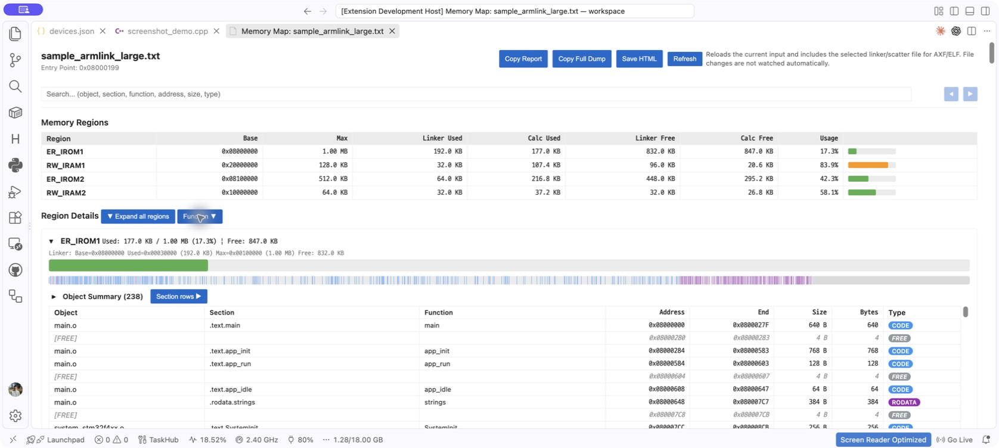

### Register Decoder — 레지스터 값 해석

`UartCtrlReg uart_ctrl = 0x30B`에 마우스를 올려 `tx_en`, `rx_en`, `baud_sel` 같은 필드 값을 읽습니다.

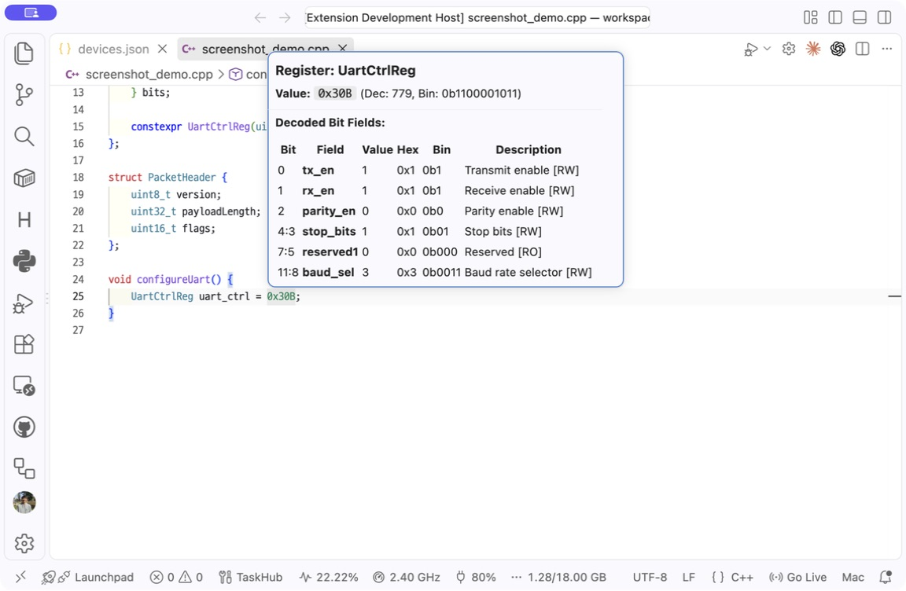

### Hex/Text — 변환, 저장값, 비트 연산

`TaskHub`를 Hex로 변환하고 자주 쓰는 값을 저장합니다. 같은 화면에서 `0x123456789ABCDEF0 & 0xFFFF` 같은 64비트 마스크 계산도 할 수 있습니다.

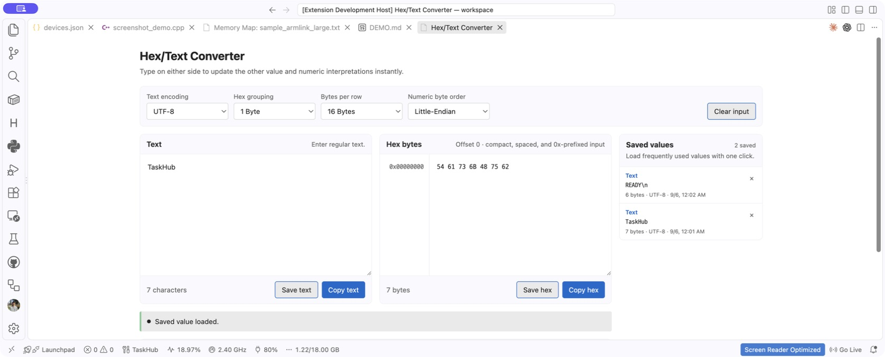

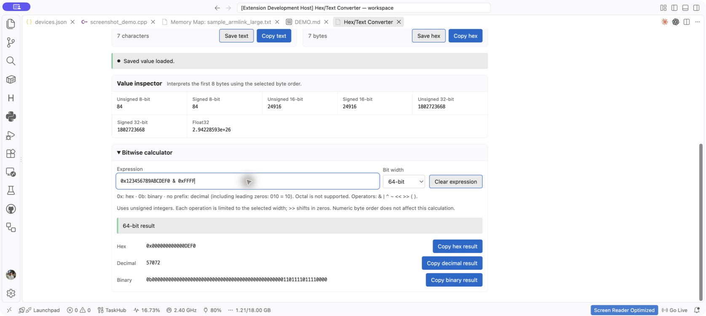

### Struct Size — 크기와 패딩 확인

`PacketHeader`의 추정 크기와 멤버별 오프셋·패딩을 코드 위에서 확인합니다.

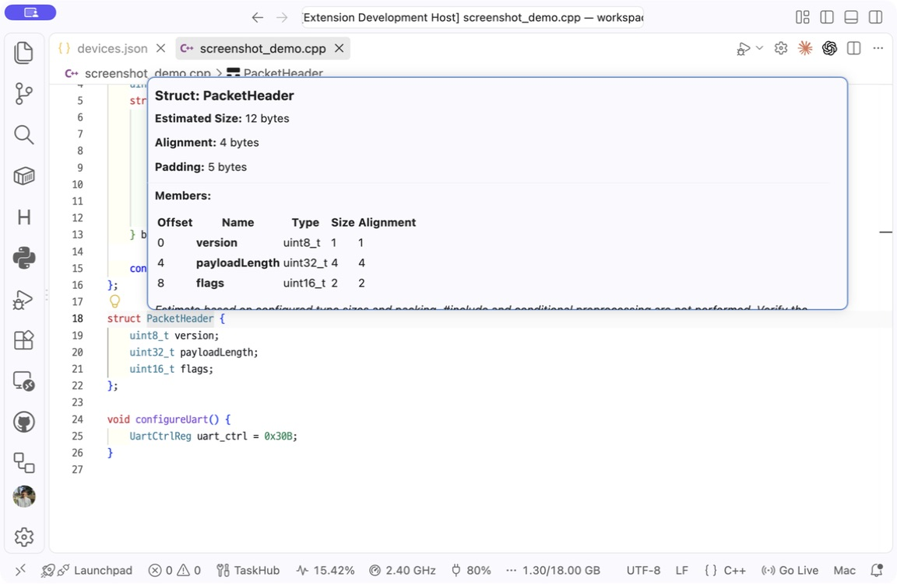

### JSON Editor — 장치 설정 편집

`devices.json`의 장치 이름·주소·활성 상태·태그를 표로 확인하고 편집합니다.

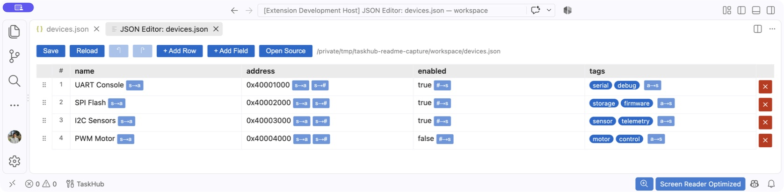

다른 기능 예시 더 보기

**Quick Action Palette** — 최근 실행 항목과 전체 액션을 검색합니다.

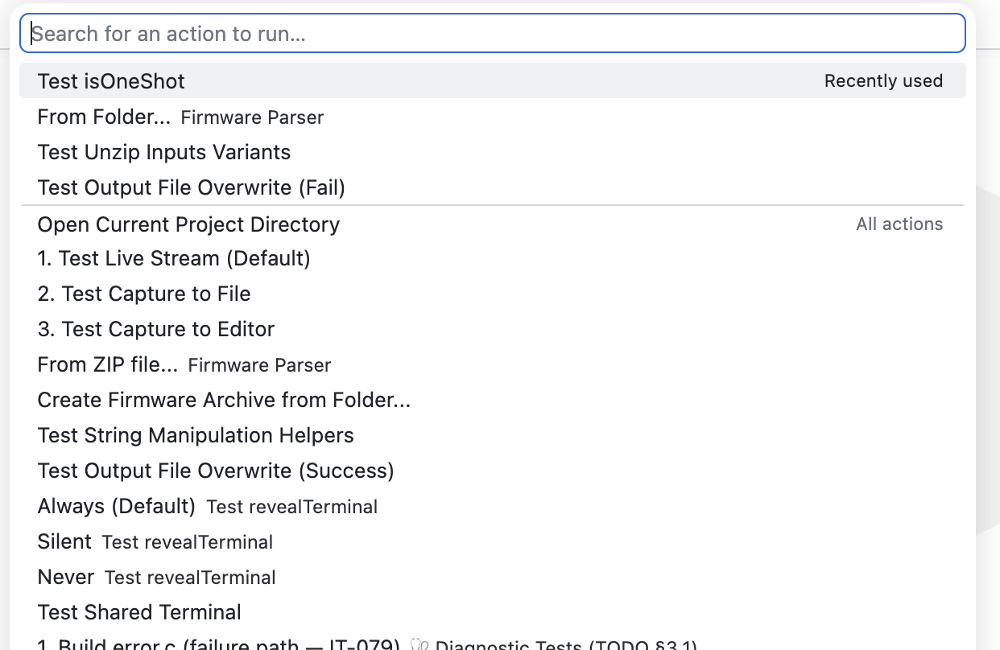

**Problem Matcher** — 빌드 진단을 Problems 패널에서 확인합니다.

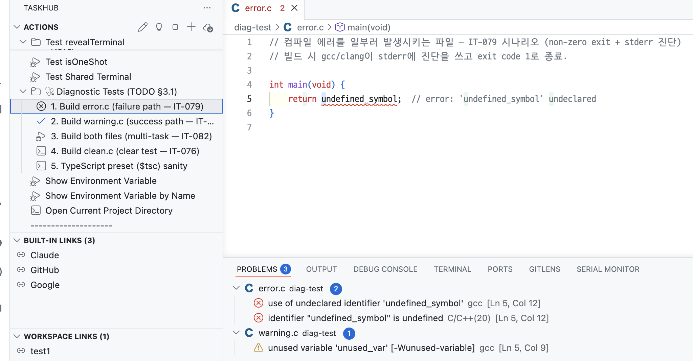

**Number Base Hover** — 숫자의 진법 변환과 비트 정보를 확인합니다.

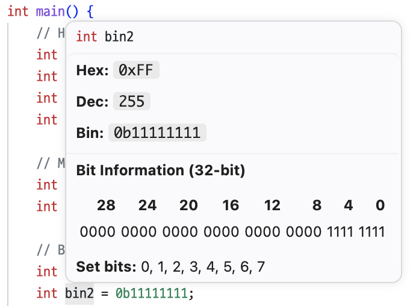

**SFR Bit Field Hover** — 비트 필드의 위치·접근 타입·리셋 값을 확인합니다.

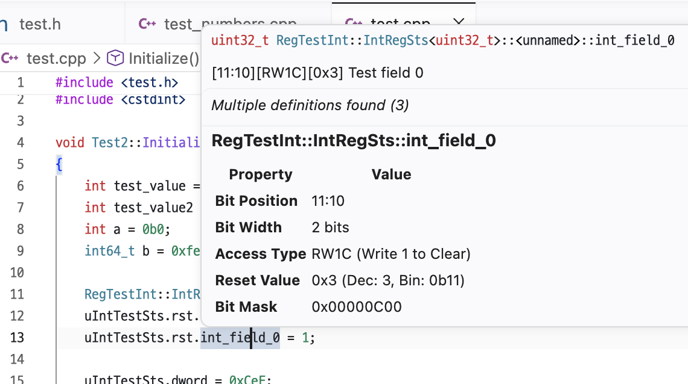

**Macro Expansion Hover** — `#define` 매크로의 최종 확장을 확인합니다.

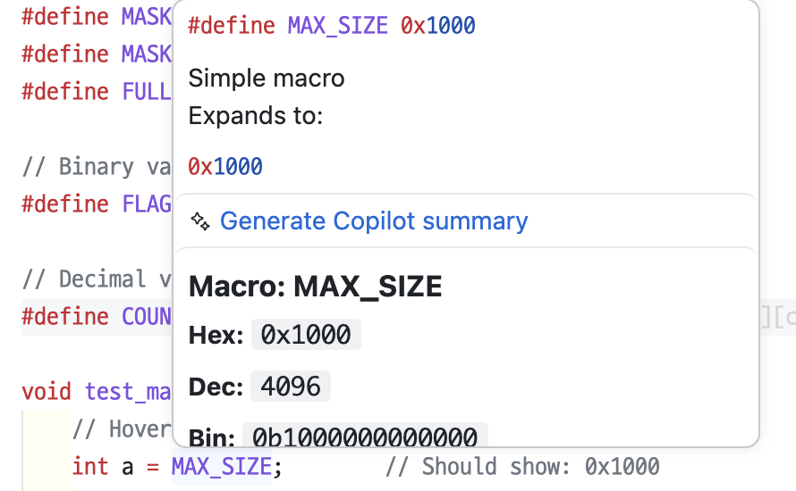

**Hex Viewer** — 바이너리 파일의 주소·Hex·ASCII를 함께 확인합니다.

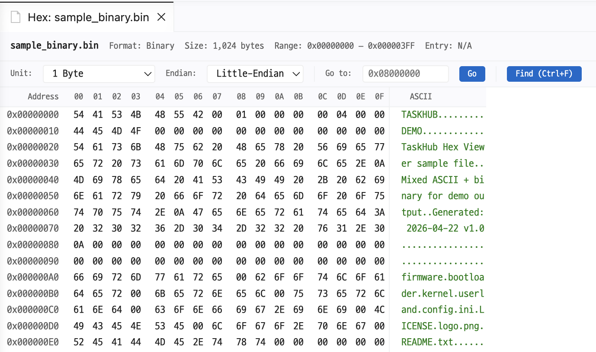

---

## 설치

### VSIX 수동 설치

1. [Releases](https://github.com/MunseopLim/TaskHub/releases)에서 최신 `.vsix` 다운로드
2. VS Code에서 `Ctrl+Shift+P` (macOS: `Cmd+Shift+P`) → **Extensions: Install from VSIX...**
3. 다운로드한 `.vsix` 파일 지정

직접 빌드하거나 기여하려면 [CONTRIBUTING.md](CONTRIBUTING.md) 참조.

---

## 사용법

1. VS Code에서 프로젝트 폴더를 열고 활동 표시줄의 **'H' 아이콘**으로 TaskHub 뷰를 엽니다.
2. Actions 패널의 **액션 만들기** 또는 **+**를 누르고 **단일 명령 실행 (Direct Command)**을 고릅니다.
3. 제목과 실행할 명령을 입력합니다. 처음에는 `echo Hello TaskHub`로 실행 흐름을 확인할 수 있습니다.
4. 확인 화면에서 **저장**을 누른 뒤 **바로 실행**을 선택하거나, Actions 패널에서 저장한 액션을 실행합니다.

다른 도구는 하단의 **TaskHub** 기능 런처에서 찾을 수 있습니다. 링크·즐겨찾기 관리와 자세한
화면 조작은 [기능 문서](docs/features.md)를 참고하세요.

액션 작성법과 태스크별 필드·결과·조합 예시는 [`actions.json` 작성 가이드](docs/actions.md)를
참고하세요.

---

## 보안

TaskHub 액션은 워크스페이스 권한으로 명령을 실행할 수 있는 **실행 가능한 설정**입니다. 신뢰할 수
없는 저장소나 `.taskhub` 파일의 액션은 실행하지 마세요. TaskHub는 VS Code의 Restricted Mode에서
비활성화됩니다. 액션을 가져올 때는 Doctor 결과와 관계없이 `actions.json`을 수정하기 전에 액션·명령·
파일 작업을 표시하고 원본 검토를 기본 동작으로 제공합니다. Doctor의 추가 진단이 없어도 고정된 악성
명령까지 안전하다는 뜻은 아닙니다. 자세한 검사 방법은
[TaskHub Doctor](docs/features.md#23-taskhub-doctor-action-lint)를 참조하세요.

---

## 설정

VS Code `File > Preferences > Settings`에서 **"TaskHub"** 로 검색하면 전체 설정을 분류별 UI로 조정할 수 있습니다. 가장 자주 손대는 항목은 `taskhub.runAnyAction.recentLimit`(Quick Action Palette의 *최근 실행* 노출 개수)와 `taskhub.history.maxItems`(History 패널 보관 개수)입니다.

설정 정의의 정본은 [package.json](package.json)의 `contributes.configuration`입니다. 사용자용 전체 키·기본값·범위와 설정 추가 절차는 [docs/features.md §21 설정 레퍼런스](docs/features.md#21-설정-레퍼런스)에 정리되어 있습니다.

---

## 문서

| 문서 | 설명 |
|------|------|
| [docs/actions.md](docs/actions.md) | `actions.json` 작성법, 태스크 타입·필드·결과와 조합 예시 |
| [docs/features.md](docs/features.md) | 패널 동작, Hover, JSON Editor, Hex/Memory Map 등 기능별 상세 문서 |
| [docs/architecture.md](docs/architecture.md) | 프로젝트 구조, 주요 컴포넌트, 데이터 구조, 보안 |
| [docs/roadmap.md](docs/roadmap.md) | 미구현 기능 우선순위와 기술 부채 |
| [CONTRIBUTING.md](CONTRIBUTING.md) | 개발 환경 셋업, 빌드, 테스트, 기여 가이드 |
| [CLAUDE.md](CLAUDE.md) | AI 에이전트 규칙 (코딩 컨벤션, i18n, 커밋 형식) |
| [CHANGELOG.md](CHANGELOG.md) | 버전별 변경 이력 |
| [examples/README.md](examples/README.md) | 각 기능 시연용 예제 파일 설명 |

---

## 라이선스

[MIT](LICENSE)
