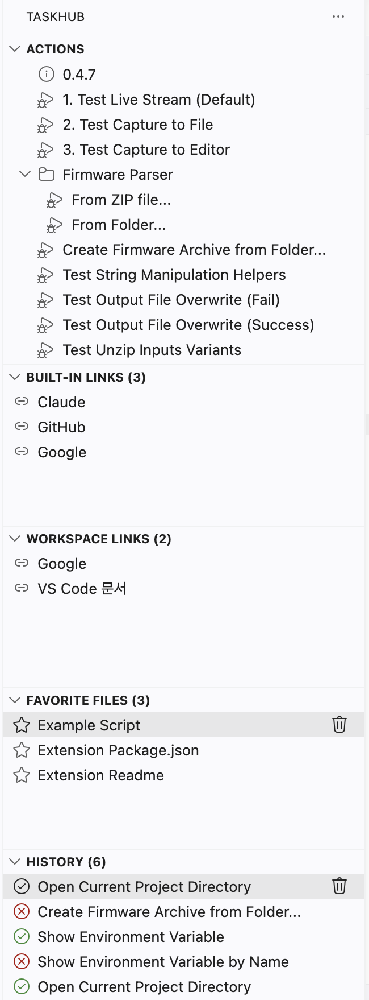
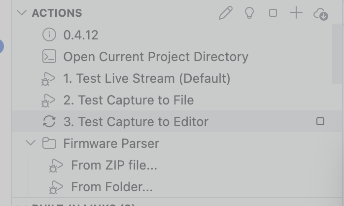
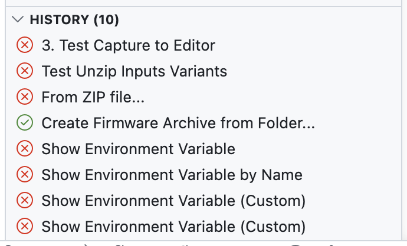
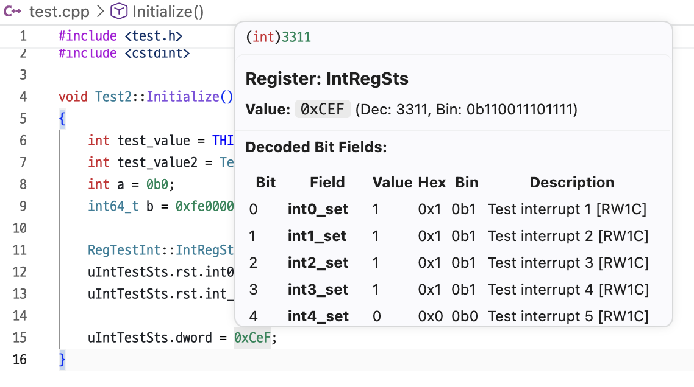
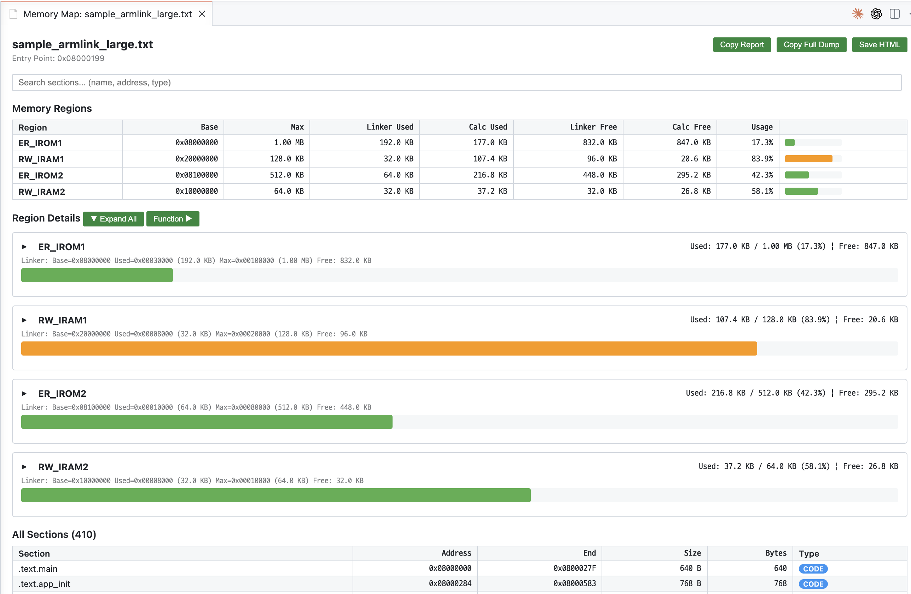
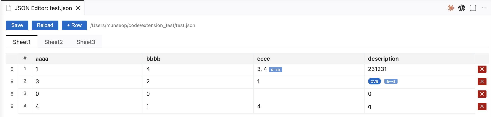

# TaskHub

> 반복적인 개발 작업을 자동화하고, 임베디드 C/C++ 개발에 특화된 hover 도구를 제공하는 VS Code 확장 프로그램.

[한국어](README.md) · [English](README.en.md)

---

## 목차

- [핵심 기능](#핵심-기능)
- [스크린샷](#스크린샷)
- [설치](#설치)
- [사용법](#사용법)
- [보안](#보안)
- [설정](#설정)
- [문서](#문서)

---

## 핵심 기능

### 워크플로우 자동화
- **사용자 정의 액션** — 셸 명령, 파일 압축/해제, 문자열 처리 등을 JSON으로 정의·실행
- **파이프라인** — 여러 태스크를 순서대로 실행하며 `${task_id.property}`로 결과 연결, `switch`로 선택값별 작업을 한곳에 구성
- **액션 생성 마법사** — 대화형 UI로 코드 작성 없이 액션 생성
- **Preset** — 팀원들과 action 설정 공유
- **실행 히스토리** — 성공/실패 추적, 새 입력 또는 저장 입력으로 명시적 재실행
- **입력 프로필** — History에서 반복 입력 조합을 이름 붙여 저장하고 액션 메뉴에서 재사용
- **Quick Action Palette** — Actions의 돋보기나 `TaskHub: 액션 실행…` 명령으로 모든 액션을 fuzzy 검색·실행. 최근 실행 항목을 상위에 표시 (개수는 설정에서 조정)
- **Status Bar 기능 런처** — 하단의 TaskHub 항목에서 자주 쓰는 기능을 검색하고 최근 선택 3개에 빠르게 접근
- **Problem Matcher** — 빌드 출력의 컴파일러 에러·경고를 Problems 패널에 자동 표시 (gcc / TypeScript 프리셋 또는 커스텀 정규식)

### 사이드바 패널
- **Actions** — 액션 버튼과 폴더 트리, 검색/그룹화
- **링크** — 워크스페이스 `.vscode/links.json` 기반 링크 관리
- **즐겨찾기** — 자주 쓰는 파일을 줄 번호와 함께 저장
- **히스토리** — 실행 기록과 상태 표시

### C/C++ Hover (임베디드 개발 특화)
- **Number Base Hover** — 숫자 리터럴의 Hex / Dec / Bin 진법 변환과 비트 정보
- **SFR Bit Field Hover** — 레지스터 비트 필드 정보 (위치, 접근 타입, 리셋 값, 마스크)
- **Register Decoder Hover** — 레지스터에 대입된 값을 비트 필드 단위로 디코드
- **Macro Expansion Hover** — `#define` 매크로의 최종 확장 결과
- **Struct Size Hover** — 구조체/클래스 크기, 멤버별 오프셋, 패딩 자동 계산
- **Bit Operation Hover** *(실험적)* — 비트 연산 결과 미리보기

### 뷰어
- **Memory Map 시각화** — ELF/AXF와 ARM Linker Listing 분석, 메모리 영역 표시, 심볼·섹션 바이트와 DWARF 소스 위치 연결
- **Hex Viewer** — 주소/16진/ASCII 3단, Unit·Endian·Go-to·Find 지원
- **Hex/Text 변환기** — 인코딩·그룹·바이트 순서를 적용해 문자열과 Hex 바이트를 실시간 변환하고 자주 쓰는 값 저장
- **JSON Editor** — JSON 배열/객체를 스프레드시트 UI로 편집

> 상세 설명과 JSON 예제는 [docs/features.md](docs/features.md) 참조.

---

## 스크린샷

### 워크플로우

<table>
  <tr>
    <td align="center" width="34%">
      <b>사이드바</b> 
      Actions · Links · Favorites · History 통합 뷰 
      
    </td>
    <td align="center" width="33%">
      <b>액션 실행</b> 
      실행 중 상태 아이콘 표시 
      
    </td>
    <td align="center" width="33%">
      <b>실행 히스토리</b> 
      성공/실패 기록 + 시각·소요 시간 배지, 빠른 재실행 
      
    </td>
  </tr>
</table>

**Quick Action Palette** — `TaskHub: 액션 실행…` 한 명령으로 모든 액션을 fuzzy 검색·실행. 최근 실행 항목은 상단 *최근 실행* 섹션에 모이고, 그 아래는 폴더 breadcrumb까지 매칭되는 전체 액션 리스트. 노출 개수는 `taskhub.runAnyAction.recentLimit`로 조정.

**Problem Matcher** — 빌드 task 출력의 컴파일러 에러·경고를 정규식으로 추출해 VS Code Problems 패널에 자동 등록. 클릭으로 파일·라인 점프, F8로 다음 진단 순환, 에디터의 빨간 squiggly까지 표시. `$gcc` / `$tsc` 내장 프리셋과 커스텀 정규식 모두 지원.

### C/C++ Hover

<table>
  <tr>
    <td align="center" width="50%">
      <b>Number Base Hover</b> 
      리터럴 진법 변환 + 32-bit 비트 맵 
      
    </td>
    <td align="center" width="50%">
      <b>Register Decoder Hover</b> 
      레지스터 값을 비트 필드별로 디코드 
      
    </td>
  </tr>
  <tr>
    <td align="center" width="50%">
      <b>SFR Bit Field Hover</b> 
      비트 필드 위치·접근 타입·리셋 값 요약 
      
    </td>
    <td align="center" width="50%">
      <b>Macro Expansion Hover</b> 
      <code>#define</code> 매크로의 최종 확장 
      
    </td>
  </tr>
</table>

### 뷰어

**Memory Map 시각화** — ELF/AXF 또는 ARM Linker Listing을 분석해 메모리 리전별 사용량·섹션·함수 분포를 시각화. GNU linker script와 ARM scatter file에서 메모리 영역도 읽으며, ELF 심볼·섹션의 원본 바이트를 Hex Viewer로 열거나 DWARF가 기록한 소스 위치로 이동할 수 있습니다.

**Hex Viewer** — 바이너리 파일을 주소/16진/ASCII 3단으로 표시. Unit(1/2/4/8 Byte), Endian, Go-to, Find 지원.

**JSON Editor** — JSON 배열/객체를 스프레드시트 형태로 편집. 행 추가/삭제/드래그와 문자열↔배열·문자열↔숫자 셀 타입 변환을 지원.

---

## 설치

### VSIX 수동 설치

1. [Releases](https://github.com/MunseopLim/TaskHub/releases)에서 최신 `.vsix` 다운로드
2. VS Code에서 `Ctrl+Shift+P` (macOS: `Cmd+Shift+P`) → **Extensions: Install from VSIX...**
3. 다운로드한 `.vsix` 파일 지정

직접 빌드하거나 기여하려면 [CONTRIBUTING.md](CONTRIBUTING.md) 참조.

---

## 사용법

1. 활동 표시줄의 **'H' 아이콘**을 클릭하여 TaskHub 뷰 열기
2. Actions 패널에서 액션 실행, 링크 패널에서 리소스에 빠르게 접근
3. `.vscode/actions.json` · `.vscode/links.json` · `.vscode/favorites.json` 파일을 편집하여 사용자 지정

액션 작성법과 태스크별 필드·결과·조합 예시는 [`actions.json` 작성 가이드](docs/actions.md)를
참고하세요.

---

## 보안

TaskHub 액션은 워크스페이스 권한으로 명령을 실행할 수 있는 **실행 가능한 설정**입니다. 신뢰할 수
없는 저장소나 `.taskhub` 파일의 액션은 실행하지 마세요. TaskHub는 VS Code의 Restricted Mode에서
비활성화됩니다. 액션을 가져올 때는 Doctor 결과와 관계없이 `actions.json`을 수정하기 전에 액션·명령·
파일 작업을 표시하고 원본 검토를 기본 동작으로 제공합니다. Doctor의 추가 진단이 없어도 고정된 악성
명령까지 안전하다는 뜻은 아닙니다. 자세한 검사 방법은
[TaskHub Doctor](docs/features.md#23-taskhub-doctor-action-lint)를 참조하세요.

---

## 설정

VS Code `File > Preferences > Settings`에서 **"TaskHub"** 로 검색하면 전체 설정을 분류별 UI로 조정할 수 있습니다. 가장 자주 손대는 항목은 `taskhub.runAnyAction.recentLimit`(Quick Action Palette의 *최근 실행* 노출 개수)와 `taskhub.history.maxItems`(History 패널 보관 개수)입니다.

설정 정의의 정본은 [package.json](package.json)의 `contributes.configuration`입니다. 사용자용 전체 키·기본값·범위와 설정 추가 절차는 [docs/features.md §21 설정 레퍼런스](docs/features.md#21-설정-레퍼런스)에 정리되어 있습니다.

---

## 문서

| 문서 | 설명 |
|------|------|
| [docs/actions.md](docs/actions.md) | `actions.json` 작성법, 태스크 타입·필드·결과와 조합 예시 |
| [docs/features.md](docs/features.md) | 패널 동작, Hover, JSON Editor, Hex/Memory Map 등 기능별 상세 문서 |
| [docs/architecture.md](docs/architecture.md) | 프로젝트 구조, 주요 컴포넌트, 데이터 구조, 보안 |
| [docs/roadmap.md](docs/roadmap.md) | 미구현 기능 우선순위와 기술 부채 |
| [CONTRIBUTING.md](CONTRIBUTING.md) | 개발 환경 셋업, 빌드, 테스트, 기여 가이드 |
| [CLAUDE.md](CLAUDE.md) | AI 에이전트 규칙 (코딩 컨벤션, i18n, 커밋 형식) |
| [CHANGELOG.md](CHANGELOG.md) | 버전별 변경 이력 |
| [examples/README.md](examples/README.md) | 각 기능 시연용 예제 파일 설명 |

---

## 라이선스

[MIT](LICENSE)
